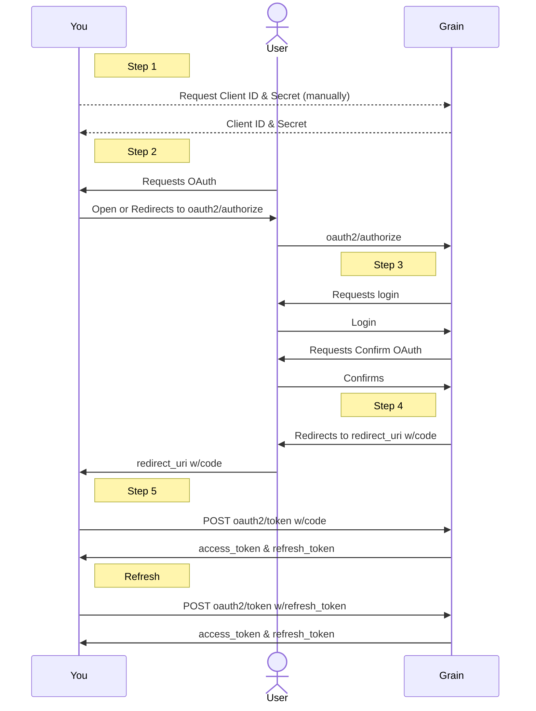

# Grain API

# Legacy Docs

If you were part of the API Beta you can find the legacy docs here:

- [(V1) Personal API Docs](https://www.notion.so/Grain-Personal-API-877184aa82b54c77a875083c1b560de9?pvs=21)
- [(V1) Workspace API Docs](https://www.notion.so/Grain-Workspace-API-1cf9dde36a4a4ee88f7231cdb2bc226d?pvs=21)

Please be aware that v1 will be sunset and some features won’t be translated to v2. As such, we don’t recommend usage of v1 anymore.

# Authentication

## Personal Access Token

These tokens can be generated to grant access to the API in a per-user basis.
Requests authenticated with these tokens are considered as “*Personal API”* and will have the same level of access as the user that generated the token has.

PATs can be generated here:
[https://grain.com/app/settings/integrations?tab=api](https://grain.com/app/settings/integrations?tab=api)

## Workspace Access Token

These tokens can be generated to grant access to the API for a general workspace use case.

Requests authenticated with these tokens are considered as “Workspace API” and will have access to **ALL DATA** from your workspace.

WAT’s can be generated here, by users with access:
[https://grain.com/app/settings/integrations?tab=api](https://grain.com/app/settings/integrations?tab=api)

## OAuth2 Flow

This authentication method is for developers building integrations with Grain to be used by any Grain users.
Requests authenticated with these tokens are considered as “*Personal API”* and will have the same level of access as the authenticated user has.

The API supports a standard OAuth2 Authorization Code flow, including the PKCE extension for client-side only authentication. A redirect URI prefix is required to register a new client. For browser-based client applications, a list of CORS origins can also be added.

### Diagram



### Step 1

Obtain the `client_id` and `client_secret` (only for server-side applications) credentials.

### Step 2

Open the url `https://grain.com/_/public-api/oauth2/authorize` with the following query params.

| **Param** |  |
| --- | --- |
| client_id | Obtained separately in [Step 1](https://www.notion.so/Grain-API-4416689b327f83cf950d0165f53e586b?pvs=21) |
| redirect_uri | Must be prefixed by the registered URI prefix |
| response_type | Must be `code` |
| code_challenge | A random string, hashed with `SHA256` and `base64` URL encoded |
| code_challenge_method | Must be `S256` |

### Step 3

If the user is not already signed in to Grain, they will be prompted to sign in.
After being authenticated, the user will be prompted to confirm the OAuth2 connection.

### Step 4

The user will be redirected to `redirect_uri` from [Step 2](https://www.notion.so/Grain-API-4416689b327f83cf950d0165f53e586b?pvs=21) with the `code` query param.

### Step 5

Make a `POST` request to generate the token.
See [OAuth2 Generate Token](https://www.notion.so/Grain-API-4416689b327f83cf950d0165f53e586b?pvs=21)

### Refresh Token

After the `access_token` has expired, you may generate a new one.

See [OAuth2 Refresh Token](https://www.notion.so/Grain-API-4416689b327f83cf950d0165f53e586b?pvs=21)

## Authenticating Calls

To authenticate API calls, the client must add the following header:

```jsx
Authorization: Bearer TOKEN
```

where `TOKEN` is either the access token obtained in the OAuth2 flow, a Personal Access Token or a Workspace Access Token.

# Versions

In addition to the authorization header, you must also include a `Public-Api-Version` header:

```jsx
Public-Api-Version: VERSION
```

Versions in the Grain-API will be used to introduce and/or deprecate fields.

Below is a list of supported versions:

| Versions |
| --- |
| 2025-10-31
**current version* |

# Rate Limits

Grain allows a total of `300` requests per minute.
Any requests beyond that limit will return a `429 Too Many Requests`

Additionally we also return the following headers with every request:

| **Header** |  |
| --- | --- |
| x-ratelimit-limit | Max number of requests allowed per window.
(300/min) |
| x-ratelimit-remaining | Number of requests remaining in the current window. |
| Retry-After
**only added if the request exceeded the limit* | Number of seconds you must wait before submitting another request. |

# Endpoints

API Domain is: `https://api.grain.com`

## OAuth2

### Generate Token

**Endpoint**

`POST /_/public-api/oauth2/token`

**Params**

| **Param** |  |
| --- | --- |
| client_id | Obtained separately in [Step 1](https://www.notion.so/Grain-API-4416689b327f83cf950d0165f53e586b?pvs=21) |
| client_secret

**required for server-side applications* | Obtained separately in [Step 1](https://www.notion.so/Grain-API-4416689b327f83cf950d0165f53e586b?pvs=21) |
| grant_type | Must be `authorization_code` |
| code | String obtained in [Step 4](https://www.notion.so/Grain-API-4416689b327f83cf950d0165f53e586b?pvs=21) |
| code_verifier | String sent as `code_challenge` in [Step 2](https://www.notion.so/Grain-API-4416689b327f83cf950d0165f53e586b?pvs=21) |

**Response**

| Field |  |
| --- | --- |
| token_type | Always `bearer` |
| access_token | Token to be used in the `Authorization` header |
| refresh_token | Token to be used to refresh the access_token
(See [Refresh Token](https://www.notion.so/Grain-API-4416689b327f83cf950d0165f53e586b?pvs=21)) |
| expires_in | Denotes how many seconds the access_token will live for after its generation. |

**Note**: Some legacy clients do not return `refresh_token` nor `expires_in`.
For these cases the access_token does not expire.

**Example Request**

```bash
curl -X POST \
     -H 'Content-Type: application/json' \
     --data '{"grant_type": "authorization_code", "code": "CODE", "client_id": "CLIENT_ID", "client_secret": "CLIENT_SECRET"}' \
     https://api.grain.com/_/public-api/oauth2/token
```

**Example Response**

```json
{
  "token_type": "bearer",
  "access_token": "aaaaa33333EEEEENNNNNoooooKKKKK33333lllll",
  "refresh_token": "IIIIIQQQQQxxxxx4444422222CCCCCoooooWWWWW",
  "expires_in": 3600
}
```

### Refresh Token

**Endpoint**

`POST /_/public-api/oauth2/token`

**Params**

| **Param** |  |
| --- | --- |
| client_id | Obtained separately in [Step 1](https://www.notion.so/Grain-API-4416689b327f83cf950d0165f53e586b?pvs=21) |
| client_secret

**required for server-side applications* | Obtained separately in [Step 1](https://www.notion.so/Grain-API-4416689b327f83cf950d0165f53e586b?pvs=21) |
| grant_type | Must be `refresh_token` |
| refresh_token | Obtained when generating or refreshing an access_token |

**Response**

| Field |  |
| --- | --- |
| token_type | Always `bearer` |
| access_token | Token to be used in the `Authorization` header |
| refresh_token | Token to be used to re-refresh the access_token |
| expires_in | Denotes how many seconds the access_token will live for after its generation. |

**Example Request**

```bash
curl -X POST \
     -H 'Content-Type: application/json' \
     --data '{"grant_type": "refresh_token", "refresh_token": "IIIIIQQQQQxxxxx4444422222CCCCCoooooWWWWW", "client_id": "CLIENT_ID", "client_secret": "CLIENT_SECRET"}' \
     https://api.grain.com/_/public-api/oauth2/token
```

**Example Response**

```json
{
  "token_type": "bearer",
  "access_token": "bbbbb44444FFFFFOOOOOpppppLLLLL44444mmmmm",
  "refresh_token": "JJJJJRRRRRyyyyy5555533333DDDDDpppppXXXXX",
  "expires_in": 3600
}
```

## Recordings

### List Recordings

**Endpoint**

`POST /_/public-api/v2/recordings`

**Params**

| **Param** | **Type** |  |
| --- | --- | --- |
| cursor | string | Used to paginate through the list. |
| filter | object | [Recording Filter](https://www.notion.so/Grain-API-4416689b327f83cf950d0165f53e586b?pvs=21) |
| include | object | [Recording Include](https://www.notion.so/Grain-API-4416689b327f83cf950d0165f53e586b?pvs=21) |

**Response**

| **Field** | **Type** |  |
| --- | --- | --- |
| cursor | string
**nullable* | Can be sent as a param to retrieve the next page of the list |
| recordings | object array | List of [Recordings](https://www.notion.so/Grain-API-4416689b327f83cf950d0165f53e586b?pvs=21) |

**Example Request**

```bash
curl -X POST \
	-H "Content-Type: application/json" \
	-H "Authorization: Bearer TOKEN" \
	-H "Public-Api-Version: 2025-10-31" \
	--data '{"filter": {"title_search": "hands"}, "include": {"participants": true}}' \
	https://api.grain.com/_/public-api/v2/recordings
```

**Example Response**

```json
{
  "cursor": "ApJNWoNoBHcCdjJ3DWNocm9ub2xvZ2ljYWx3BGRlc2NoAm4HAO5FaSm2QgZuBwAVPC0qtkIG",
  "recordings": [
    {
      "id": "pppp6666-qq77-rr88-ss99-tttt00000000",
      "title": "All Hands",
      "source": "zoom",
      "url": "https://grain.com/share/recording/pppp6666-qq77-rr88-ss99-tttt00000000",
      "media_type": "video",
      "tags": [],
      "start_datetime": "2025-01-01T09:30:00Z",
      "teams": [
        {
          "id": "aaaa1111-bb22-cc33-dd44-eeee55555555",
          "name": "My Team"
        }
      ],
      "participants": [
        {
          "id": "eeee1111-ff22-gg33-hh44-iiii55555555",
          "name": "Luke Skywalker",
          "scope": "internal",
          "email": "luke@example.com",
          "confirmed_attendee": true
        },
        {
          "id": "jjjj6666-kk77-ll88-mm99-nnnn00000000",
          "name": "Han Solo",
          "scope": "internal",
          "email": "solo@example.com",
          "confirmed_attendee": false
        }
      ],
      "end_datetime": "2025-01-01T10:00:00Z",
      "duration_ms": 1800000,
      "thumbnail_url": "https://media.grain.com/public_thumbnails/recordings/pppp6666",
      "meeting_type": {
        "id": "ffff6666-gg77-hh88-ii99-jjjj00000000",
        "name": "Project & Team Coordination",
        "scope": "internal"
      }
    }
  ]
}
```

### Get Recording

**Endpoint**

`POST /_/public-api/v2/recordings/:recording_id`

**Params**

| **Param** | **Type** |  |
| --- | --- | --- |
| include | object | [Recording Include](https://www.notion.so/Grain-API-4416689b327f83cf950d0165f53e586b?pvs=21) |

**Response**

| **Field** | **Type** |  |
| --- | --- | --- |
| [Recording](https://www.notion.so/Grain-API-4416689b327f83cf950d0165f53e586b?pvs=21) | object |  |

**Example Request**

```bash
curl -X POST \
	-H "Content-Type: application/json" \
	-H "Authorization: Bearer TOKEN" \
	-H "Public-Api-Version: 2025-10-31" \
	--data '{"include": {"participants": true}}' \
	https://api.grain.com/_/public-api/v2/recordings/pppp6666-qq77-rr88-ss99-tttt00000000
```

**Example Response**

```json
{
  "id": "pppp6666-qq77-rr88-ss99-tttt00000000",
  "title": "All Hands",
  "source": "zoom",
  "url": "https://grain.com/share/recording/pppp6666-qq77-rr88-ss99-tttt00000000",
  "media_type": "video",
  "tags": [],
  "start_datetime": "2025-01-01T09:30:00Z",
  "teams": [
    {
      "id": "aaaa1111-bb22-cc33-dd44-eeee55555555",
      "name": "My Team"
    }
  ],
  "participants": [
    {
      "id": "eeee1111-ff22-gg33-hh44-iiii55555555",
      "name": "Luke Skywalker",
      "scope": "internal",
      "email": "luke@example.com",
      "confirmed_attendee": true
    },
    {
      "id": "jjjj6666-kk77-ll88-mm99-nnnn00000000",
      "name": "Han Solo",
      "scope": "internal",
      "email": "solo@example.com",
      "confirmed_attendee": false
    }
  ],
  "end_datetime": "2025-01-01T10:00:00Z",
  "duration_ms": 1800000,
  "thumbnail_url": "https://media.grain.com/public_thumbnails/recordings/pppp6666",
  "meeting_type": {
    "id": "ffff6666-gg77-hh88-ii99-jjjj00000000",
    "name": "Project & Team Coordination",
    "scope": "internal"
  }
}
```

### Get Recording Transcript (json)

**Endpoint**

`GET /_/public-api/v2/recordings/:recording_id/transcript`

**Params**

N/A

**Response**

| **Field** | **Type** |  |
| --- | --- | --- |
| participant_id | UUID string
**nullable* | id of the participant |
| speaker | string | Name of the participant |
| start | integer | Timestamp in ms from the recording of when this section started. |
| end | integer | Timestamp in ms from the recording of when this section ended. |
| text | string | Text of this transcript section. |

**Example Request**

```bash
curl \
	-H "Content-Type: application/json" \
	-H "Authorization: Bearer TOKEN" \
	-H "Public-Api-Version: 2025-10-31" \
	https://api.grain.com/_/public-api/v2/recordings/pppp6666-qq77-rr88-ss99-tttt00000000/transcript
```

**Example Response**

```json
[
  {
    "start": 8000,
    "text": "Hello there.",
    "end": 9000,
    "speaker": "Obi Wan Kenobi",
    "participant_id": "oooo1111-pp22-qq33-rr44-ssss55555555"
  },
  {
    "start": 11482,
    "text": "General Kenobi...",
    "end": 13000,
    "speaker": "General Grievous",
    "participant_id": "yyyy1111-zz22-aabb-cc44-dddd55555555"
  }
]
```

### Get Recording Transcript (text formats)

**Endpoint**

`GET /_/public-api/v2/recordings/:recording_id/transcript.txt`

`GET /_/public-api/v2/recordings/:recording_id/transcript.vtt`

`GET /_/public-api/v2/recordings/:recording_id/transcript.srt`

**Params**

N/A

**Response**

*Transcript text*

**Example Request**

```bash
curl \
  -H "Authorization: Bearer TOKEN" \
  -H "Public-Api-Version: 2025-10-31" \
	https://api.grain.com/_/public-api/v2/recordings/pppp6666-qq77-rr88-ss99-tttt00000000/transcript.txt
```

**Example Response**

```
Obi Wan Kenobi: Hello there.
General Grievous: General Kenobi...
```

### Download Recording

**Endpoint**

`GET /_/public-api/v2/recordings/:recording_id/download`

**Params**

N/A

**Response**

*Recording file*

**Example Request**

```bash
curl \
  -H "Authorization: Bearer TOKEN" \
  -H "Public-Api-Version: 2025-10-31" \
  -L --output recording.mp4 \
	https://api.grain.com/_/public-api/v2/recordings/pppp6666-qq77-rr88-ss99-tttt00000000/download
```

**Example Response**

*Recording file*

### Upload Recording

**Supported formats**:

- `.mov`
- `.mp4`
- `.mp3`
- `.m4a`

**Step 1: Generate Upload URL**

First a URL has to be generated to which you will be able to upload the file to.

**Endpoint**:

`POST /_/public-api/v2/recordings/:recording_id/download`

**Params**

| **Param** | **Type** |  |
| --- | --- | --- |
| filename
**required* | string | Name of the upload file |
| user_id
**Workspace API Only
*required* | UUID string | User to own the recording.
Obtained through [List Users](https://www.notion.so/Grain-API-4416689b327f83cf950d0165f53e586b?pvs=21) |

**Response**

| **Field** | **Type** |  |
| --- | --- | --- |
| uuid | UUID string | id of the upload, will be present in the upload hooks if a `upload_status` hook exists |
| url | string | url to upload the file to |
| max_duration_sec | integer | Max duration in seconds the upload can be |
| max_upload_bytes | integer | Max size in bytes the upload can be |

**Example Request**

```bash
curl -X POST \
	-H "Content-Type: application/json" \
	-H "Authorization: Bearer TOKEN" \
	-H "Public-Api-Version: 2025-10-31" \
	--data '{"filename": "recording.mp4"}' \
	https://api.grain.com/_/public-api/v2/recordings/upload
```

**Example Response**

```json
{
  "url": "https://example.com/generated_url",
  "uuid": "eeee-1f2g-3h4i-5j6k-7890-abcd2222",
  "max_duration_sec": 10800,
  "max_upload_bytes": 4294967296
}
```

**Step 2: Upload the file**

Now the file can be uploaded to the generated url.

Please note that even after the upload finishes Grain still needs process the file. 
Grain will post progress messages, the resulting `recording_id` and/or possible error messages to existing `upload_status` hooks. ([Create Hook](https://www.notion.so/Grain-API-4416689b327f83cf950d0165f53e586b?pvs=21))

**Example Request**

```bash
curl -X PUT --upload-file recording.mp4 "https://example.com/generated_url"
```

**Example Response**

N/A

### Update Recording

**Endpoint**

`PATCH /_/public-api/v2/recordings/:recording_id`

**Params**

| **Param** | **Type** |  |
| --- | --- | --- |
| title | string | New title for the recording |

**Response**

| **Field** | **Type** |  |
| --- | --- | --- |
| success | Always `true` |  |

**Example Request**

```bash
curl -X PATCH \
  -H "Content-Type: application/json" \
	-H "Authorization: Bearer TOKEN" \
	-H "Public-Api-Version: 2025-10-31" \
	--data '{"title": "A new title"}' \
	https://api.grain.com/_/public-api/v2/recordings/pppp6666-qq77-rr88-ss99-tttt00000000
```

**Example Response**

```json
{
  "success": true
}
```

### Add a Tag to a Recording

**Endpoint**

`PUT /_/public-api/v2/recordings/:recording_id/tags`

**Params**

| **Param** | **Type** |  |
| --- | --- | --- |
| tag | Regex checked string

*format*: ([Regex101](https://regex101.com/r/ZYrnZV))
`/^[\p{L}\d][\p{L}\d-]*$/u` | Tag to be added to the recording

(Letters and numbers separated by dashes `-` ) |

**Response**

| **Field** | **Type** |  |
| --- | --- | --- |
| success | Always `true` |  |

**Example Request**

```bash
curl -X PUT \
	-H "Content-Type: application/json" \
	-H "Authorization: Bearer TOKEN" \
	-H "Public-Api-Version: 2025-10-31" \
	--data '{"tag": "my-new-tag"}' \
	https://api.grain.com/_/public-api/v2/recordings/pppp6666-qq77-rr88-ss99-tttt00000000/tags
```

**Example Response**

```json
{
  "success": true
}
```

### Remove a Tag from a Recording

**Endpoint**

`DELETE /_/public-api/v2/recordings/:recording_id/tags/:tag`

**Params**

N/A

**Response**

| **Field** | **Type** |  |
| --- | --- | --- |
| success | Always `true` |  |

**Example Request**

```bash
curl -X DELETE \
	-H "Authorization: Bearer TOKEN" \
	-H "Public-Api-Version: 2025-10-31" \
	https://api.grain.com/_/public-api/v2/recordings/pppp6666-qq77-rr88-ss99-tttt00000000/tags/my-new-tag
```

**Example Response**

```json
{
  "success": true
}
```

### Share Recording to an User

**Endpoint**

`PUT /_/public-api/v2/recordings/:recording_id/users`

**Params**

| **Param** | **Type** |  |
| --- | --- | --- |
| user_id | UUID string | User to share the recording with.
Obtained through [List Users](https://www.notion.so/Grain-API-4416689b327f83cf950d0165f53e586b?pvs=21) |

**Response**

| **Field** | **Type** |  |
| --- | --- | --- |
| success | Always `true` |  |

**Example Request**

```bash
curl -X PUT \
	-H "Content-Type: application/json" \
	-H "Authorization: Bearer TOKEN" \
	-H "Public-Api-Version: 2025-10-31" \
	--data '{"user_id": "7890-abcd-ef01-2222-3456-7890ffff"}' \
	https://api.grain.com/_/public-api/v2/recordings/pppp6666-qq77-rr88-ss99-tttt00000000/users
```

**Example Response**

```json
{
  "success": true
}
```

### Unshare Recording from an User

**Endpoint**

`DELETE /_/public-api/v2/recordings/:recording_id/users/:user_id`

**Params**

N/A

**Response**

| **Field** | **Type** |  |
| --- | --- | --- |
| success | Always `true` |  |

**Example Request**

```bash
curl -X DELETE \
	-H "Authorization: Bearer TOKEN" \
	-H "Public-Api-Version: 2025-10-31" \
	https://api.grain.com/_/public-api/v2/recordings/pppp6666-qq77-rr88-ss99-tttt00000000/users/7890-abcd-ef01-2222-3456-7890ffff
```

**Example Response**

```json
{
  "success": true
}
```

### Share Recording to a Team

**Endpoint**

`PUT /_/public-api/v2/recordings/:recording_id/teams/:team_id`

**Params**

| **Param** | **Type** |  |
| --- | --- | --- |
| team_id | UUID string | User to share the recording with.
Obtained through [List Teams](https://www.notion.so/Grain-API-4416689b327f83cf950d0165f53e586b?pvs=21) |

**Response**

| **Field** | **Type** |  |
| --- | --- | --- |
| success | Always `true` |  |

**Example Request**

```bash
curl -X PUT \
	-H "Content-Type: application/json" \
	-H "Authorization: Bearer TOKEN" \
	-H "Public-Api-Version: 2025-10-31" \
	--data '{"team_id": "aaaa1111-bb22-cc33-dd44-eeee55555555"}' \
	https://api.grain.com/_/public-api/v2/recordings/pppp6666-qq77-rr88-ss99-tttt00000000/teams
```

**Example Response**

```json
{
  "success": true
}
```

### Unshare Recording from a Team

**Endpoint**

`DELETE /_/public-api/v2/recordings/:recording_id/teams/:team_id`

**Params**

N/A

**Response**

| **Field** | **Type** |  |
| --- | --- | --- |
| success | Always `true` |  |

**Example Request**

```bash
curl -X DELETE \
	-H "Authorization: Bearer TOKEN" \
	-H "Public-Api-Version: 2025-10-31" \
	https://api.grain.com/_/public-api/v2/recordings/pppp6666-qq77-rr88-ss99-tttt00000000/teams/aaaa1111-bb22-cc33-dd44-eeee55555555
```

**Example Response**

```json
{
  "success": true
}
```

## Hooks

### Create Hook

**Endpoint**

`POST /_/public-api/v2/hooks/create`

**Params**

| **Param** | **Type** |  |
| --- | --- | --- |
| hook_url
**required* | string | Endpoint to be called when the event is triggered.

A reachability test is made to the provided url on creation.
The endpoint **must** respond with a `2xx` status in order to successfully create the hook. |
| hook_type
**required* | One of:
- `recording_added`
- `recording_updated`
- `recording_deleted`

- `highlight_added`
- `highlight_updated`
- `highlight_deleted`

- `story_added`
- `story_updated`
- `story_deleted`

- `upload_status` | Type of notifications the hook will be sent. |
| include | object | - `recording_added`
- `recording_updated`
[Recording Include](https://www.notion.so/Grain-API-4416689b327f83cf950d0165f53e586b?pvs=21)

- `highlight_added`
- `highlight_updated`
[Highlight Include](https://www.notion.so/Grain-API-4416689b327f83cf950d0165f53e586b?pvs=21)

- `recording_deleted`
- `highlight_deleted`
- `story_added`
- `story_updated`
- `story_deleted`
- `upload_status`
N/A |

**Response**

| **Field** | **Type** |  |
| --- | --- | --- |
| [Hook](https://www.notion.so/Grain-API-4416689b327f83cf950d0165f53e586b?pvs=21) | object |  |

**Example Request**

```bash
curl \
  -X POST \
  -H "Authorization: Bearer TOKEN" \
  -H "Content-Type: application/json" \
  -H "Public-Api-Version: 2025-10-31" \
  --data '{"hook_type": "recording_added", "hook_url": "https://example.com/hook"}' \
  https://api.grain.com/_/public-api/v2/hooks/create
```

**Example Response**

```json
{
  "enabled": true,
  "id": "zzzz6666-aa77-bb88-cc99-dddd00000000",
  "include": {},
  "inserted_at": "2025-01-01T09:30:00Z",
  "hook_url": "https://example.com/hook",
  "hook_type": "recording_added"
}
```

### List Hooks

**Endpoint**

`POST /_/public-api/v2/hooks`

**Params**

| **Param** | **Type** |  |
| --- | --- | --- |
| filter | object | [Hook Filter](https://www.notion.so/Grain-API-4416689b327f83cf950d0165f53e586b?pvs=21) |

**Response**

| **Field** | **Type** |  |
| --- | --- | --- |
| hooks | object array | List of [Hooks](https://www.notion.so/Grain-API-4416689b327f83cf950d0165f53e586b?pvs=21) |

**Example Request**

```bash
curl -X POST \
	-H "Content-Type: application/json" \
	-H "Authorization: Bearer TOKEN" \
	-H "Public-Api-Version: 2025-10-31" \
	https://api.grain.com/_/public-api/v2/hooks
```

**Example Response**

```json
{
  "hooks": [
    {
      "enabled": true,
      "id": "zzzz6666-aa77-bb88-cc99-dddd00000000",
      "include": {},
      "inserted_at": "2025-01-01T09:30:00Z",
      "hook_url": "https://example.com/hook",
      "hook_type": "recording_added"
    }
  ]
}
```

### Delete Hook

**Endpoint**

`DELETE /_/public-api/v2/hooks/:hook_id`

**Params**

N/A

**Response**

| **Field** | **Type** |  |
| --- | --- | --- |
| success | Always `true` |  |

**Example Request**

```bash
curl -X DELETE \
	-H "Authorization: Bearer TOKEN" \
	-H "Public-Api-Version: 2025-10-31" \
	https://api.grain.com/_/public-api/v2/hooks/zzzz6666-aa77-bb88-cc99-dddd00000000
```

**Example Response**

```json
{
  "success": true
}
```

### Hook Payload Example

```json
{
  "type": "recording_added",
  "user_id": "eeee1111-ff22-gg33-hh44-iiii55555555",
  "data": {
    "id": "pppp6666-qq77-rr88-ss99-tttt00000000",
    "title": "All Hands",
    "source": "zoom",
    "url": "https://grain.com/share/recording/pppp6666-qq77-rr88-ss99-tttt00000000",
    "media_type": "video",
    "tags": [],
    "start_datetime": "2025-01-01T09:30:00Z",
    "teams": [
      {
        "id": "aaaa1111-bb22-cc33-dd44-eeee55555555",
        "name": "My Team"
      }
    ],
    "end_datetime": "2025-01-01T10:00:00Z",
    "duration_ms": 1800000,
    "thumbnail_url": "https://media.grain.com/public_thumbnails/recordings/pppp6666",
    "meeting_type": {
      "id": "ffff6666-gg77-hh88-ii99-jjjj00000000",
      "name": "Project & Team Coordination",
      "scope": "internal"
    }
  }
}
```

## Others

### List Users

**Endpoint**

`POST /_/public-api/v2/users`

**Params**

N/A

**Response**

| **Field** | **Type** |  |
| --- | --- | --- |
| users | object array | List of [Users](https://www.notion.so/Grain-API-4416689b327f83cf950d0165f53e586b?pvs=21) |

**Example Request**

```bash
curl -X POST \
	-H "Content-Type: application/json" \
	-H "Authorization: Bearer TOKEN" \
	-H "Public-Api-Version: 2025-10-31" \
	https://api.grain.com/_/public-api/v2/users
```

**Example Response**

```json
{
  "users": [
    {
      "id": "7890-abcd-ef01-2222-3456-7890ffff",
      "name": "Luke Skywalker",
      "email": "luke@example.com"
    }
  ]
}
```

### List Teams

**Endpoint**

`POST /_/public-api/v2/teams`

**Params**

N/A

**Response**

| **Field** | **Type** |  |
| --- | --- | --- |
| teams | object array | List of [Teams](https://www.notion.so/Grain-API-4416689b327f83cf950d0165f53e586b?pvs=21) |

**Example Request**

```bash
curl -X POST \
	-H "Content-Type: application/json" \
	-H "Authorization: Bearer TOKEN" \
	-H "Public-Api-Version: 2025-10-31" \
	https://api.grain.com/_/public-api/v2/teams
```

**Example Response**

```json
{
  "teams": [
    {
      "id": "aaaa1111-bb22-cc33-dd44-eeee55555555",
      "name": "My Team"
    }
  ]
}
```

### List Meeting Types

**Endpoint**

`POST /_/public-api/v2/meeting_types`

**Params**

N/A

**Response**

| **Field** | **Type** |  |
| --- | --- | --- |
| meeting_types | object array | List of [Meeting Types](https://www.notion.so/Grain-API-4416689b327f83cf950d0165f53e586b?pvs=21) |

**Example Request**

```bash
curl -X POST \
	-H "Content-Type: application/json" \
	-H "Authorization: Bearer TOKEN" \
	-H "Public-Api-Version: 2025-10-31" \
	https://api.grain.com/_/public-api/v2/meeting_types
```

**Example Response**

```json
{
  "meeting_types": [
    {
      "id": "aaaa1111-bb22-cc33-dd44-eeee55555555",
      "name": "Sales",
      "scope": "external"
    },
    {
      "id": "ffff6666-gg77-hh88-ii99-jjjj00000000",
      "name": "Project & Team Coordination",
      "scope": "internal"
    }
  ]
}
```

## Common Params

### Recording Filter

This object is used to filter for specific recordings.

| **Param** | **Type** |  |
| --- | --- | --- |
| before_datetime | ISO8601 formatted timestamp
`2025-01-01T09:30:00Z` | Only return recordings which `start_datetime` is after the selected date (exclusive) |
| after_datetime | ISO8601 formatted timestamp
`2025-01-01T09:30:00Z` | Only return recordings which `start_datetime` is before the selected date (inclusive) |
| attendance

**Personal API Only* | One of:
- `hosted`
- `attended` | `hosted`
Only return recordings where the user was the meeting host.

`attended`
Only return recordings where the user attended the meeting. |
| participant_scope | One of:
- `internal`
- `external` | `internal`
Only return recordings of internal / team meetings.

`external`
Only return recordings of external / customer meetings. |
| title_search | string | Only return recordings which title matches the given search string. |
| team | uuid | Only return recordings which team matches the given team id.

Team ids can be found through the [List Teams Endpoint](https://www.notion.so/Grain-API-4416689b327f83cf950d0165f53e586b?pvs=21). |
| meeting_type | uuid | Only return recordings which meeting type matches the given meeting type id.

Meeting type ids can be found through the [List Meeting Types Endpoint](https://www.notion.so/Grain-API-4416689b327f83cf950d0165f53e586b?pvs=21). |

### Recording Include

| **Param** | **Type** |  |
| --- | --- | --- |
| highlights | boolean | Include clips / highlights in the response |
| participants | boolean | Include participants in the response |
| ai_action_items | boolean | Include the ai_action_items in the response |
| ai_summary | boolean | Include the ai_summary in the response |
| private_notes

**Personal API Only* | boolean | Include your private notes in the response |
| calendar_event | boolean | Include calendar event data in the response |
| hubspot | boolean | Include HubSpot related data in the response |
| ai_template_sections | object | Includes ai_template_sections in the response |
| *ai_template_sections*
  format
 | One of:
- `json`
- `markdown`
- `text` | Controls the output of ai_template_sections

Defaults to `json` |
| *ai_template_sections*
  allowed_sections | string array | Only include sections which `title` matches the given `allowed_sections`

Case insensitive |

### Highlight Include

| **Param** | **Type** |  |
| --- | --- | --- |
| transcript | boolean | Include the highlight’s transcript in the response. |
| speakers | boolean | Include the highlight’s speakers in the response |

### Hook Filter

| **Param** | **Type** |  |
| --- | --- | --- |
| hook_type | One of:<br>- `recording_added`<br>- `recording_updated`<br>- `recording_deleted`<br>- `highlight_added`<br>- `highlight_updated`<br>- `highlight_deleted`<br>- `story_added`<br>- `story_updated`<br>- `story_deleted`<br>- `upload_status` | Only return hooks with the matching `hook_type` |
| state | One of:<br>- `enabled`<br>- `disabled` | Only return hooks that are either enabled or disabled. |

## Common Responses

### Recording

| **Field** | **Type** |  |
| --- | --- | --- |
| id | UUID string | Id of the recording |
| title | string | Title of the recording |
| start_datetime | ISO8601 formatted timestamp
`2025-01-01T09:30:00Z` | UTC datetime at which grain started the recording |
| end_datetime | ISO8601 formatted timestamp
`2025-01-01T09:30:00Z` | UTC datetime at which the recording ended |
| duration_ms | integer | Duration of the recording in ms |
| media_type | One of:
- `audio`
- `transcript`
- `video` | Media type of the recording |
| source | One of:
- `aircall`
- `local_capture`
- `meet`
- `teams`
- `upload`
- `webex`
- `zoom`
- `other` | From what source did Grain get the recording |
| url | string | URL to the recording in Grain |
| thumbnail_url | string
**nullable* | URL to the recording’s thumbnail |
| highlights | object array | List of [Highlights](https://www.notion.so/Grain-API-4416689b327f83cf950d0165f53e586b?pvs=21) |
| tags | string array | Tags of the recording |
| teams | object array | List of [Teams](https://www.notion.so/Grain-API-4416689b327f83cf950d0165f53e586b?pvs=21) the recording belongs to. |
| meeting_type | object
**nullable* | Recording’s [Meeting Type](https://www.notion.so/Grain-API-4416689b327f83cf950d0165f53e586b?pvs=21) |
| ai_template_sections

*include: ai_template_sections* | object array | List of [AI Template Sections](https://www.notion.so/Grain-API-4416689b327f83cf950d0165f53e586b?pvs=21) |
| ai_action_items

*include: ai_action_items* | object array | List of Action Items |
| *ai_action_items*
  status | One of:
- `pending`
- `completed` | Status of the action item |
| *ai_action_items*
  timestamp | integer | Observed timestamp in ms at which the action item was mentioned |
| *ai_action_items*
  text | string | Content of the action item |
| *ai_action_items*
  assignee | object
**nullable* | Assignee of the action item |
| *ai_action_items*
  *assignee*
    id | UUID string | Id of the assignee |
| *ai_action_items*
  *assignee*
    name | string | Name of the assignee |
| *ai_action_items*
  *assignee*
    user_id | UUID string
**nullable* | User id of the assignee |
| ai_summary

*include: ai_summary* | object |  |
| *ai_summary*
  text | markdown formatted string | Markdown text of the ai summary |
| calendar_event

*include: calendar_event* | object
**nullable* |  |
| *calendar_event*
  ical_uid | string | Ical UID of the related event |
| hubspot

*include: hubspot* | object |  |
| *hubspot*
  hubspot_company_ids | string array | List of HubSpot company id’s related to the recording |
| *hubspot*
  husbpot_deal_ids | string array | List of HubSpot deal id’s related to the recording |
| participants

*include: participants* | object array |  |
| *participants*
  id | UUID string | id of the participant |
| *participants*
  name | string | Name of the participant |
| *participants*
  email | string
**nullable* | Email of the participant |
| *participants*
  scope | One of:
- `internal`
- `external`
- `unknown` | Scope of the participant |
| *participants*
  confirmed_attendee | boolean | Whether or not the participant was present in the recording |
| *participants*
  hs_contact_id

*include: hubspot* | string
**nullable* | HubSpot contact id of the particpant |
| private_notes

*include: private_notes* | object
**nullable* |  |
| *private_notes*
  text | string | Markdown text of the user’s private notes |

### Highlight (aka Clip)

| **Field** | **Type** |  |
| --- | --- | --- |
| id | UUID string | id of the highlight |
| recording_id | UUID string | id of the recording it was clipped from |
| text | string | Small description of the clip, equivalent to a title |
| transcript | string | Transcript of the clip formatted as text |
| speakers | string array | Names of the speakers of the clip |
| timestamp | integer | Timestamp in ms from the recording of when the clip starts |
| duration | integer | Duration of the clip in ms |
| tags | string array | Tags of the clip |
| url | string | URL to the highlight in Grain |
| thumbnail_url | string | URL to the hightlights’s thumbnail |
| created_datetime | ISO8601 formatted timestamp
`2025-01-01T09:30:00Z` | UTC datetime of when the clip was created |

### Hook

| **Field** | **Type** |  |
| --- | --- | --- |
| id | UUID string | id of the hook |
| enabled | boolean | Whether the hook is enabled or not |
| hook_url | string | URL to which Grain will post to |
| hook_type | One of:
- `recording_added`
- `recording_updated`
- `recording_deleted`
- `highlight_added`
- `highlight_updated`
- `highlight_deleted`
- `story_added`
- `story_updated`
- `story_deleted`
- `upload_status` | Type of notifications the hook will be sent. |
| include | object | `recording_added`
`recording_updated`
[Recording Include](https://www.notion.so/Grain-API-4416689b327f83cf950d0165f53e586b?pvs=21) the hook was created with.

`highlight_added`
`highlight_updated`
[Highlight Include](https://www.notion.so/Grain-API-4416689b327f83cf950d0165f53e586b?pvs=21) the hooks was created with.

`recording_deleted`
`highlight_deleted`
`story_added`
`story_updated`
`story_deleted`
`upload_status`
Always an empty object |
| inserted_at | ISO8601 formatted timestamp
`2025-01-01T09:30:00Z` | UTC datetime of when the hook was created |

### User

| **Field** | **Type** |  |
| --- | --- | --- |
| id | UUID string | id of the user |
| name | string | Name of the user |
| email | string | Primary email of the user |

### Team

| **Field** | **Type** |  |
| --- | --- | --- |
| id | UUID string | id of the team |
| name | string | Name of the team |

### Meeting Type

| **Field** | **Type** |  |
| --- | --- | --- |
| id | UUID string | id of the meeting type |
| name | string | Name of the meeting type |
| scope | One of:
- `internal`
- `external` | Scope of the meeting type |

### AI Template Sections

| **Field** | **Type** |  |
| --- | --- | --- |
| title | string | Title of the section |
| data | object | Fields depend on the type of section. |